- 👋 Hi, I’m @jradtke-suse
- 👀 I’m interested in ... All Things SUSE: Linux, Hybrid-Cloud/Edge, Kubernetes, AI, Security, Storage, Virtualization 
- 🌱 I’m currently learning ... 
- 💞️ I’m looking to collaborate on ...
- 📫 How to reach me ...

- This is not an official SUSE repo.  My jradtke-suse Git Repo is a collection of stuff I use personally.  My HomeLab, interests (NVIDIA), etc..
- What this Repo is not: a training program or curriculum.   There are many other folks already doing a great job at that.

| Service - Username     | URL                                      |
|:-----------------------|:-----------------------------------------|
| GitHub - jradtke-suse  | https://github.com/jradtke-suse      |
| Medium - @cloudxabide  | https://medium.com/@cloudxabide/     |
| Credly - cloudxabide   | https://credly.com/users/cloudxabide |

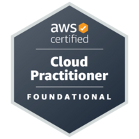
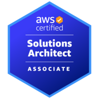
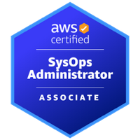
 
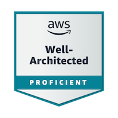
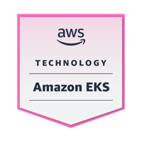

 
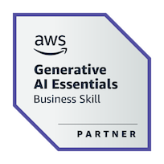
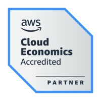
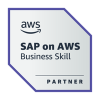
 
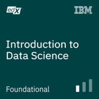
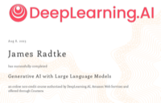
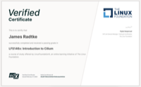

## Certifications (Expired/Old)
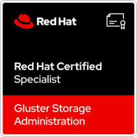
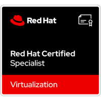
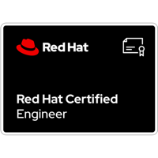

# Best Practices and suggestions
* Do NOT use the "Root Account" for anything other than creating new IAM accounts, or managing IdentityCenter assets.
* Use MFA.  Always. (where possible)
* Create and use a ["tagging strategy"](https://docs.aws.amazon.com/general/latest/gr/aws_tagging.html) of some sort.
* (NEW) Identity Center is tremendous and quite powerful.  I recommend using it.

<!---
jradtke-suse/jradtke-suse is a ✨ special ✨ repository because its `README.md` (this file) appears on your GitHub profile.
You can click the Preview link to take a look at your changes.
--->
